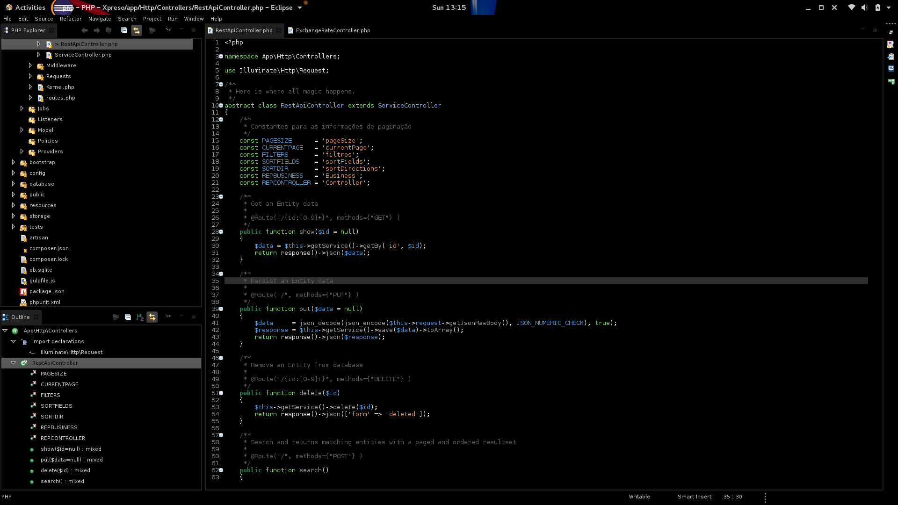
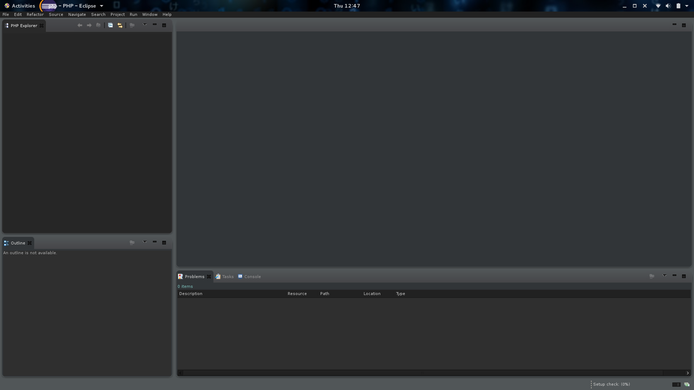

# Eclipse Neon

Eclipse Neon JEE, C++, PHP, JS and Android

Requirements:

   $ sudo yum install -y 'gtk2-engines-*' 'gtk3-engines*'

## Midnight Devil

- Install Eclipse Neon on /opt/eclipse/something
- Download eclipse-midnight.tgz
- Disable themming on "Window > Preferences > General > Appearance"
- Unpack, as root, on your filesystem root
- Import "/opt/eclipse/Midnight_Devil.epf" preferences on Eclipse ("Import > Preferences")
- Start eclipse using:

	env SWT_GTK3=0 GTK2_RC_FILES=/opt/eclipse/midnight.gtkrc  GTK_THEME=Adwaita:dark /opt/eclipse/cpp-neon/eclipse/eclipse

Obs: the .tar.gz has /usr/share/application/eclipse*.desktop entries for the Gnome Shell.
 

Bellow is my old theme using Moonrise, for those who like a lighter theme. In pt_BR only.

## Usando o tema e o Moonrise com o Moonrise Devil

Este procedimento precisa ser feito para cada Workspace que tiver. Não tenha apenas um para tudo para evitar problemas de
performance. Faça uma instalação do Neon por objetivo (estou com 4: PHP, JS, Android e JEE).

- Instale o Eclipse Neon para o que quiser (PHP, JEE, etc) em /opt/eclipse/php-neon (por exemplo)
- Abra o Gnome Tweak:
    - Defina o thema GTK e Shell para FlatPlat, Icons e Cursor para Paper
    - Ative o Global Dark Theme
- Abra o Eclipse:
    - Selecione o workspace como ~/workspace/php (não misture o workspace de linguagens diferentes, ou terá terá todo tipo 
      de problema de plugins, e não instale tudo em um para não deixá-lo pesado).
      de não ter permissão de escrita, e essa máquina for só sua, mude o owner da pasta para o seu usuário.
    - Instale pelo Eclipse MarketPlace o Eclipse Color Theme para escolher um tema de cores que lhe agrade à vista (eu criei o meu, Midnight Devil)
    - Instale pelo Eclipse MarketPlace o tema Moonrise (standalone) no Eclipse. Escolha ele como padrão.
    - Redimensione a coluna da esquerda de forma tal que os botões subam para o lado do título da aba
    - Arraste aquela barrinha inútil de operações de background no canto inferior direito da barra de status para o toolbar
    - No Eclipse, escolha Window > Appearance > Hide toolbar
- Teste a instalação dos itens necessários abrindo um shell e indo até a pasta do eclipse que instalou (no caso, php)

  	$ cd ~/eclipse
  	$ export SWT_GTK3=0
  	$ export GTK2_RC_FILES=/usr/share/darktable/darktable.gtkrc
  	$ export GTK_THEME=Adwaita:dark
  	$ ./eclipse
  
- Ao criar o atalho do Eclipse-PHP (ou a linguagem que instalou, lembre-se de qual versão baixou, e onde:

	[Desktop Entry]
	Name=Eclipse PHP
	Exec=env SWT_GTK3=0 GTK2_RC_FILES=/usr/share/darktable/darktable.gtkrc GTK_THEME=Adwaita:dark /opt/eclipse/php-neon/eclipse/eclipse
	Type=Application
	Icon=/opt/eclipse/php-neon/eclipse/icon.xpm

untar it from root as root

	# mv ~/Downloads/eclipse-neon-gnome.tgz /
	# tar -zxvf eclipse-neon-gnome.tgz

Press meta-key and type eclipse. You should see all 4 there.

Requeries to turn on the dark theme on Gnome Tweak Tool, and FlatPlat as GTK theme

